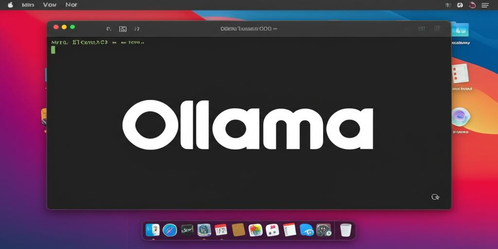

# Ollama LaunchDaemon Setup Script

[](banner.jpg)

## Purpose

This script automates the setup of Ollama as a background service on macOS using LaunchDaemons. It ensures that Ollama is always running and automatically checks for updates on an hourly basis.

## Key Features

*   **Automatic Startup:** Configures Ollama to start automatically when your Mac boots.
*   **Continuous Operation:** Ensures Ollama continues running in the background.
*   **Automatic Updates:** Checks for and installs Ollama updates hourly.

## Prerequisites

*   macOS
*   Homebrew ([https://brew.sh/](https://brew.sh/))
*   Ollama (install via `brew install ollama` if not already installed)

## How to Use

1.  **Save the Script:** Save the provided script ( `ollama_setup_revised_v2.sh` ) to your local machine.
2.  **Make Executable:** Open the terminal and make the script executable:

    ```bash
    chmod +x ollama_setup_revised_v2.sh
    ```
3.  **Run with Sudo:** Execute the script with root privileges using `sudo`:

    ```bash
    sudo ./ollama_setup_revised_v2.sh
    ```

    You will be prompted for your administrator password.

4.  **Verification:** After the script completes, verify that the Ollama service is running.  See the script output for commands to check the status and logs.

## Examples

**Running the script:**

```bash
sudo ./ollama_setup_revised_v2.sh
```

(Follow the on-screen prompts)

## Post-Installation

The script will display instructions on how to check the service status and logs. The Ollama models are stored under `/var/root/.ollama/models`.

## Uninstallation

To remove the LaunchDaemons created by this script, you'll need to manually remove the created files and unload the services.

1.  **Unload the Daemons:**

    ```bash
    sudo launchctl bootout system/com.ollama.serve
    sudo launchctl bootout system/com.ollama.update
    ```

    If `bootout` fails, try the older `unload` command:

    ```bash
    sudo launchctl unload -w /Library/LaunchDaemons/com.ollama.serve.plist
    sudo launchctl unload -w /Library/LaunchDaemons/com.ollama.update.plist
    ```

2.  **Remove the Files:**

    ```bash
    sudo rm /Library/LaunchDaemons/com.ollama.serve.plist
    sudo rm /Library/LaunchDaemons/com.ollama.update.plist
    sudo rm /usr/local/bin/ollama_update_helper.sh
    ```

## Important Notes

*   This script configures Ollama to run as root.  Models will be stored under `/var/root/.ollama/models`. If you prefer models in your user directory, consider setting up Ollama as a User Agent instead.  This script is not designed for User Agent setup.
*   Ensure Homebrew and Ollama are correctly installed before running the script.
